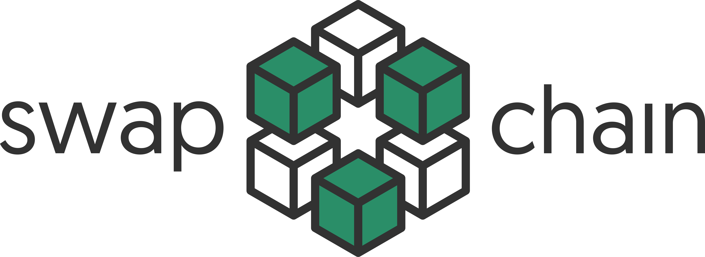

> Swapchain is an application for performing ACCS (atomic cross chain swaps) via HTLCs (hash-time-locked contracts).

## Installation
... to be added.

## Development setup
... to be added once code style is agreed upon

## License

This project is [MIT](https://github.com/kefranabg/readme-md-generator/blob/master/LICENSE) licensed.